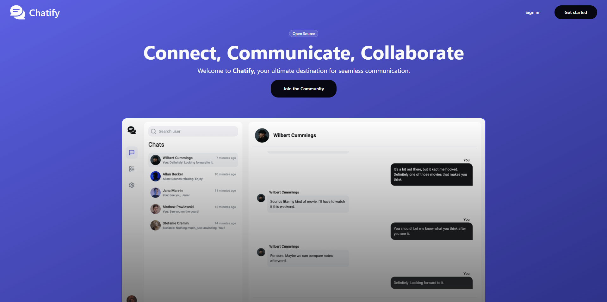

> **⚡ Important Notice:** The API is hosted on a free-tier service, so the initial request may take longer than usual to wake up the server.

<div align="center">
    
  <h1 align="center">Chatify</h1>
  <p align="center">
    An open-source real-time messaging platform
    <br />
    Built with React, NestJS, and powered by Turborepo
  </p>
  
  <p align="center">
    <a href="https://chatify-lm.vercel.app"><strong>🚀 Live Demo</strong></a>
    ·
    <a href="#-features"><strong>✨ Features</strong></a>
    ·
    <a href="#-getting-started"><strong>📖 Documentation</strong></a>
    ·
    <a href="#-contributing"><strong>🤝 Contributing</strong></a>
  </p>
</div>

<br />

<p align="center">
  
</p>

<br />

## 📰 About the Project

**Chatify** is an open-source messaging platform. Built with a robust tech stack including React 19, NestJS, and GraphQL, it offers a seamless chat experience with real-time messaging and note-taking capabilities.

This project uses a monorepo architecture powered by Turborepo, ensuring scalable and maintainable code across multiple applications and shared packages.

### 🎯 Project Goals

- **Modern Architecture**: Leverage the latest technologies and best practices
- **Real-time Communication**: Provide instant messaging with WebSocket subscriptions
- **Developer Experience**: Maintain high code quality with TypeScript, ESLint, and automated workflows
- **Scalability**: Design for growth with modular architecture and shared components
- **Open Source**: Foster community collaboration and learning

## 🔴 Live Demo

👉 **[Experience Chatify Live](https://chatify-lm.vercel.app)**

### 🔐 Test Credentials

Get started immediately with one of our test accounts:

| Account     | Email            | Password   |
| ----------- | ---------------- | ---------- |
| Test User 1 | `test1@test.com` | `testtest` |
| Test User 2 | `test2@test.com` | `testtest` |
| Test User 3 | `test3@test.com` | `testtest` |
| Test User 4 | `test4@test.com` | `testtest` |
| Test User 5 | `test5@test.com` | `testtest` |

💡 **Tip**: You can also create your own account for a personalized experience!

## ⚙️ Features

- 💬 **Real-time messaging** - Instant message delivery with WebSocket subscriptions
- 📝 **Note taking** - Personal notes integrated within the chat interface
- 📁 **Image upload** - Upload images with AWS S3 integration
- 🔐 **User authentication** - Secure JWT-token based authentication
- 🎨 **Responsive design** - Mobile-friendly UI

## 📁 What's inside?

This turborepo includes the following packages and apps:

### 🚀 Apps

- **`api`** - NestJS backend server with GraphQL API
- **`web`** - React frontend application built with Vite and Tanstack Router

### 📦 Packages

- **`@chatify/ui`** - Shared component library built with ShadcnUI components and TailwindCSS
- **`@chatify/config-eslint`** - ESLint configuration presets for consistent code quality across the monorepo
- **`@chatify/config-typescript`** - TypeScript configuration presets for unified compilation settings

## 🧑‍💻 Tech Stack

### Frontend (Web App)

- **React 19**
- **Vite**
- **TanStack Router**
- **Shadcn/ui**
- **TailwindCSS**
- **URQL**

### Backend (API)

- **NestJS**
- **Apollo GraphQL**
- **Drizzle ORM**
- **PostgreSQL**
- **AWS S3**

### Development Tools

- **Turborepo**
- **TypeScript**
- **ESLint**
- **Prettier**
- **Husky**

## 🚀 Getting Started

### Prerequisites

- Node.js 20+
- pnpm 10+
- PostgreSQL database
- Redis database
- AWS S3 bucket

### Installation

1. **Clone the repository**

   ```bash
   git clone https://github.com/lukaszzm/Chatify-2.0.git
   cd Chatify-2.0
   ```

2. **Install dependencies**

   ```bash
   pnpm install
   ```

3. **Set up environment variables**

   ```bash
   # Copy environment files
   cp apps/api/.env.template apps/api/.env
   cp apps/web/.env.template apps/web/.env

   # Configure your variables
   ```

4. **Set up the database**

   ```bash
   cd apps/api
   pnpm db:push
   ```

5. **Start development servers**

   ```bash
   # From root directory
   pnpm dev
   ```

### Available Scripts

- `pnpm dev` - Start all apps in development mode
- `pnpm build` - Build all apps for production
- `pnpm lint` - Lint all packages
- `pnpm lint:fix` - Auto-fix linting issues
- `pnpm format` - Format code with Prettier

## 🏗️ Project Structure

```
Chatify-2.0/
├── apps/
│   ├── api/          # NestJS backend
│   └── web/          # React frontend
├── packages/
│   ├── ui/           # Shared components
│   ├── config-eslint/    # ESLint configs
│   └── config-typescript/ # TypeScript configs
├── turbo.json        # Turborepo configuration
└── package.json      # Root package.json
```

## 🤝 Contributing

Contributions are welcome! Please feel free to submit a Pull Request. For major changes, please open an issue first to discuss what you would like to change.

1. Fork the project
2. Create your feature branch (`git checkout -b feature/amazing-feature`)
3. Commit your changes (`git commit -m 'Add some amazing feature'`)
4. Push to the branch (`git push origin feature/amazing-feature`)
5. Open a Pull Request

## 🙏 Acknowledgments

- Built with [Turborepo](https://turbo.build/)
- UI components from [Shadcn/ui](https://ui.shadcn.com/)
- Icons from [Lucide](https://lucide.dev/)
